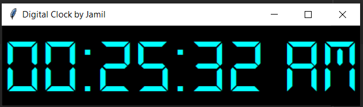

# Digital-Clock
### This is all about How to make a clock using python. This is a simple python project. 
## To make the clock format 12 hrs. Simply change the strftime('%H:%M:%S %p') to strftime('%I:%M:%S %p')

# ScreenShots
The window is look like that.

